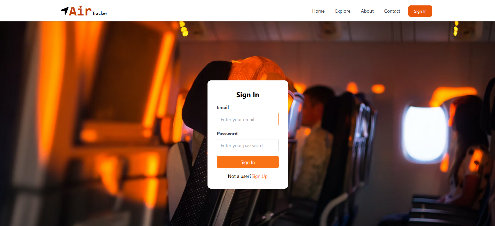
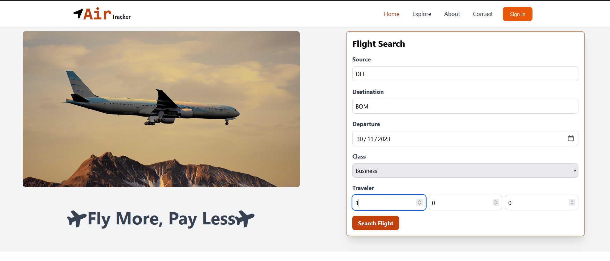
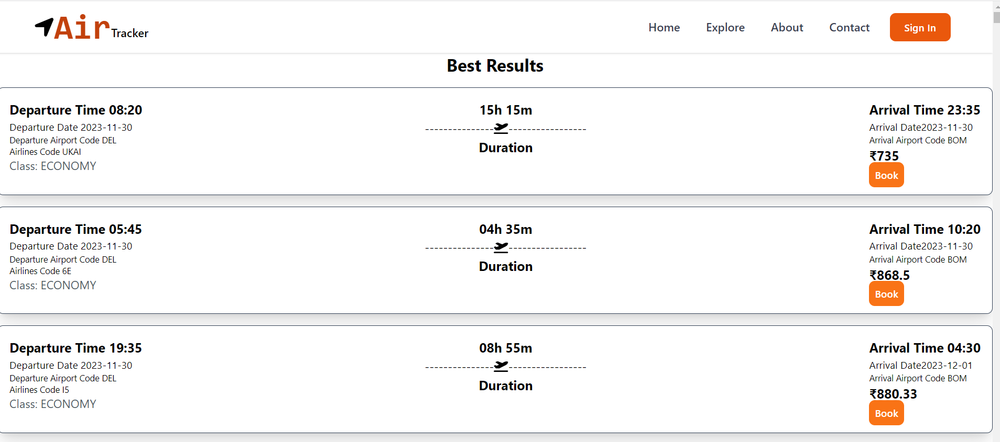
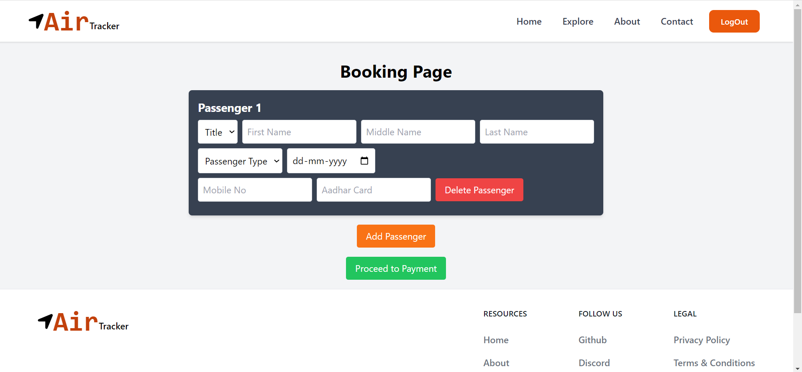
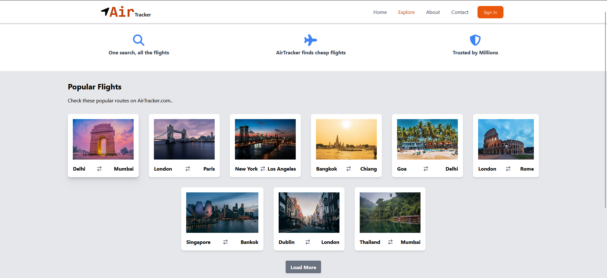

<h1 align="center">AirTracker - Affordable Flight Companion</h1>
<div align="center">
<a href="https://github.com/sudhanshu-77/AirTracker/graphs/contributors"></a>
<a href="https://github.com/sudhanshu-77/AirTracker/issues"></a>
<a></a>
<a></a>

[](https://visitcount.itsvg.in)
</div>


## <a align="left"> Live Website </a> [Link](https://airtraker.netlify.app/).


### Objective:
The main objectives of this project are to develop a web application that allows users to:
* 	Search for the cheapest flights
* 	Track ticket prices
  
### Scope:
The project will cover the following features:
* 	Flight search functionality: Users can search for flights by specifying their origin, destination, and travel dates. The application will display a list of flights with their corresponding prices.
* 	Ticket price tracking: Users can track the prices of flights that they are interested in. The application will notify users when the price of a tracked flight changes.
* 	Price change notification: Users can receive notifications about price changes for tracked flights via email or SMS.

### Methodology:
The project will be developed by using the following technologies:
* 	Frontend: React, HTML, CSS, and JavaScript
* 	Backend: Node.js, Express.js, and MongoDB
* 	Other tools: Git, GitHub, and Visual Studio Code

### Proposed System:
The AirTracker application will be a web application that will be accessible to users on any device with a web browser. The application will use a variety of APIs to fetch flight data and to send price change notifications.
Features:
The following are the key features of the AirTracker application:
* 	Flight search functionality
* 	Ticket price tracking
* 	Price change notification

### Implementation Plan:
The following is a high-level implementation plan for the AirTracker project:
1.	Design the database schema.
2.	Develop the backend API.
3.	Develop the frontend user interface.
4.	Integrate the frontend and backend components.
5.	Test the application.
6.	Deploy the application.

### Resources Required:
The following resources are required for the project:
* 	Frontend technologies: HTML, CSS, JavaScript, and React
* 	Backend technologies: Node.js, Express.js, and MongoDB
* 	Basic tools: Git, GitHub, and Visual Studio Code

### References:
The following resources will be used as references for the project:
* Online resources: YouTube, Google, Technologies Documentations, etc.
* Other resources: Mentor guidance.
<p align="right">(<a href="#top">Back to top</a>)</p>

## Requirements

- nodejs
- npm

## Getting started

To get started with this project, first install the npm dependencies:

```bash
npm install
```

Next, run the development server:

```bash
npm run dev
```
Next, open localhost server:

```bash
localhost:5173
```


## Output:

## <a align="left"> Project Demonstration Video </a> [Link](https://youtu.be/O0dEew24_XM?si=XBNtTMTE5BO2LzJH).

## Login :


## Home :


## Best Results :


## Passenger Booking :


## Explore more :


<p align="right">(<a href="#top">Back to top</a>)</p>


